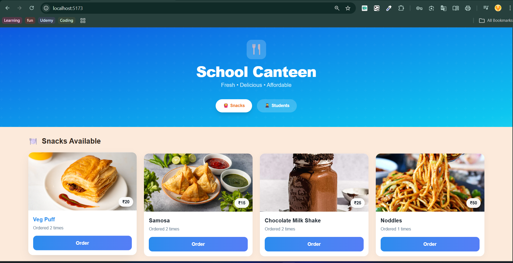
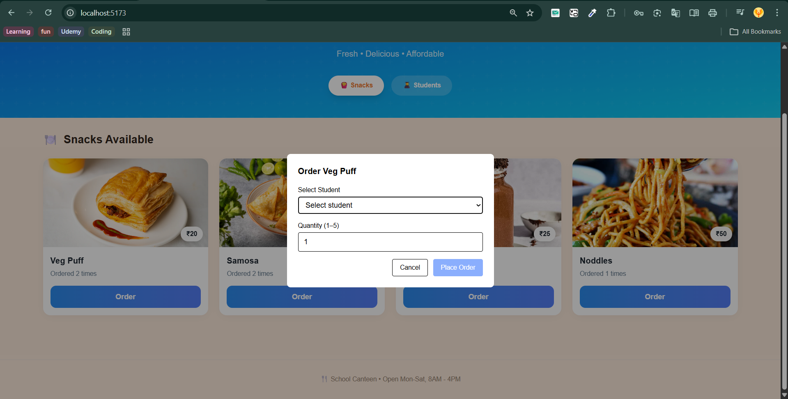
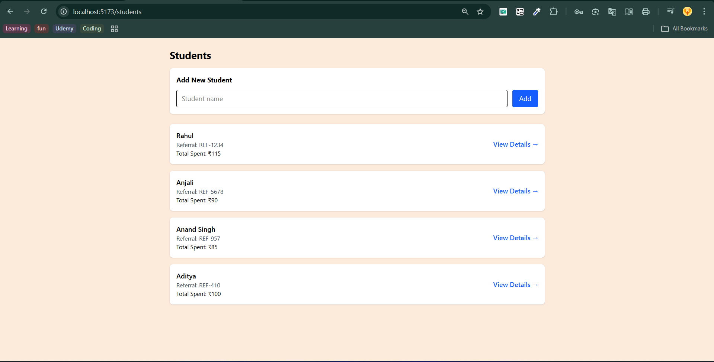
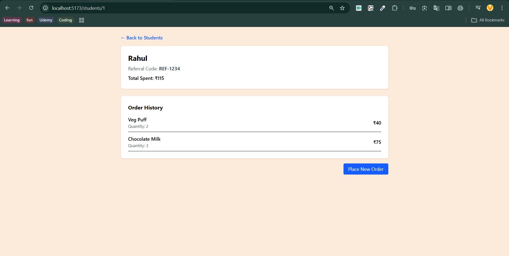

# 🍽️ School Canteen Management System

## 📌 Project Overview

A **React + Redux Toolkit** based frontend application with a **mock backend (json-server)** that simulates a real-world school canteen ordering system.

This project allows:

* Viewing available snacks
* Creating students
* Placing snack orders for students
* Tracking student spending and order history

The goal of this project is to demonstrate **clean state management, API interaction, and modular UI design**.

---

## 📸 Project Screenshots


### 🧾 Snacks Page



### 🛒 Order Modal



### 👥 Students Page



### 👤 Student Detail Page



---

## 🧠 How the Project Works (High-Level)

### 🔄 Data Flow Overview

```
Backend (db.json) → Redux Store → React UI
```

* **Backend (`json-server`)** stores snacks, students, and orders
* **Redux Toolkit** manages application state in memory
* **React Components** render UI based on Redux state
* **React Router** handles page navigation

---

## 🛠️ Tech Stack

### 🎨 Frontend

* React (Vite)
* Redux Toolkit
* React Redux
* React Router DOM
* Tailwind CSS v4

### 🗄️ Backend (Mock)

* json-server

---

## 📁 Project Folder Structure

```
src/
├── components/
│   ├── layout/
│   │   └── Container.jsx
│   ├── snacks/
│   │   └── SnacksCard.jsx
│   ├── students/
│   │   ├── CreateStudentForm.jsx
│   │   └── StudentCard.jsx
│   ├── order/
│   │   └── OrderModal.jsx
│
├── pages/
│   ├── StudentsPage.jsx
│   └── StudentDetailPage.jsx
│
├── store/
│   ├── features/
│   │   ├── snacksSlice.js
│   │   ├── studentSlice.js
│   │   └── ordersSlice.js
│   └── store.js
│
├── App.jsx
├── main.jsx
```

---

## 🔌 Backend Setup (json-server)

### 1️⃣ Install json-server

```bash
npm install -g json-server
```

### 2️⃣ Create `db.json`

```json
{
  "snacks": [],
  "students": [],
  "orders": []
}
```

### 3️⃣ Start Backend Server

```bash
npx json-server --watch db.json --port 3000
```

### 4️⃣ API Endpoints

| Method | Endpoint      |
| ------ | ------------- |
| GET    | /snacks       |
| GET    | /students     |
| GET    | /students/:id |
| POST   | /students     |
| POST   | /orders       |
| PUT    | /students/:id |
| PUT    | /snacks/:id   |

---

## ▶️ Frontend Setup

### 1️⃣ Install Dependencies

```bash
npm install
```

### 2️⃣ Start Development Server

```bash
npm run dev
```

App runs at:

```
http://localhost:5173
```

---

## 🧾 Application Features

### 🍔 Snacks Page

* Displays all snacks
* Shows price and order count
* Allows ordering via modal

### 🛒 Order Modal

* Select student
* Select quantity (1–5)
* Places order and updates:

  * Orders table
  * Student total spent & history
  * Snack order count

### 👥 Students Page

* List of all students
* Referral code & total spent
* Create new student

### 👤 Student Detail Page

* Student information
* Complete order history
* Total amount spent
* Option to place new order

---

## 🔄 Data Flow (Simple Explanation)

1. Page loads → Redux fetches data
2. Redux stores data in memory
3. React renders UI
4. User places order
5. Backend updates
6. Redux syncs
7. UI re-renders

---

## 💡 Key Learnings

* Redux Toolkit for scalable state management
* Async actions with `createAsyncThunk`
* Separation of UI and business logic
* Backend & frontend data sync
* Real-world state handling

---

## 🚀 Future Enhancements

* Authentication
* Admin dashboard
* Order analytics
* Image uploads
* Pagination & search